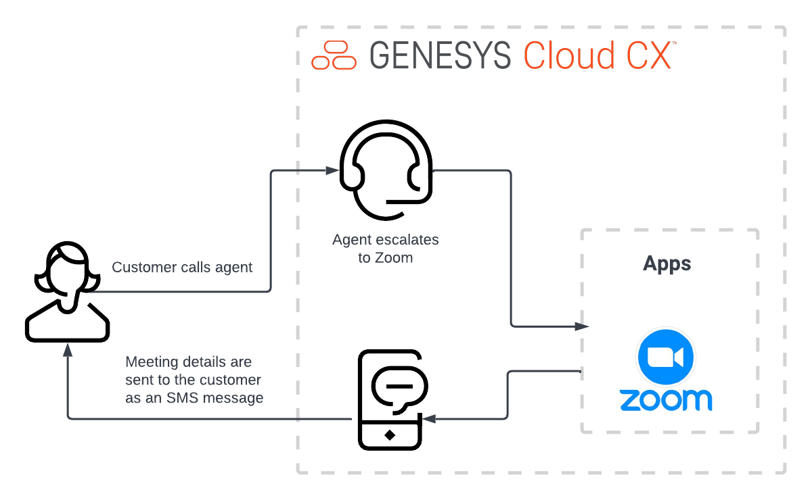

#  Zoom meeting on Genesys Cloud Blueprint (Draft)

> View the full [Zoom meeting on Genesys Cloud Blueprint article](https://developer.mypurecloud.com/blueprints/zoom-meetings-sms/) in the Genesys Cloud Developer Center.

This Genesys Cloud Developer Blueprint explains how to set up Genesys Cloud and Zoom so that agents can schedule a Zoom meeting while they are interacting with customers as part of an inbound or outbound call. When an agent escalates to Zoom, Genesys Cloud automatically sends an SMS message with the meeting URL to the customer and also opens the Zoom meeting for the agent. The call must be in a queue in order for this solution to work.

The following illustration shows the meeting scheduling solution from an agent’s point of view.

